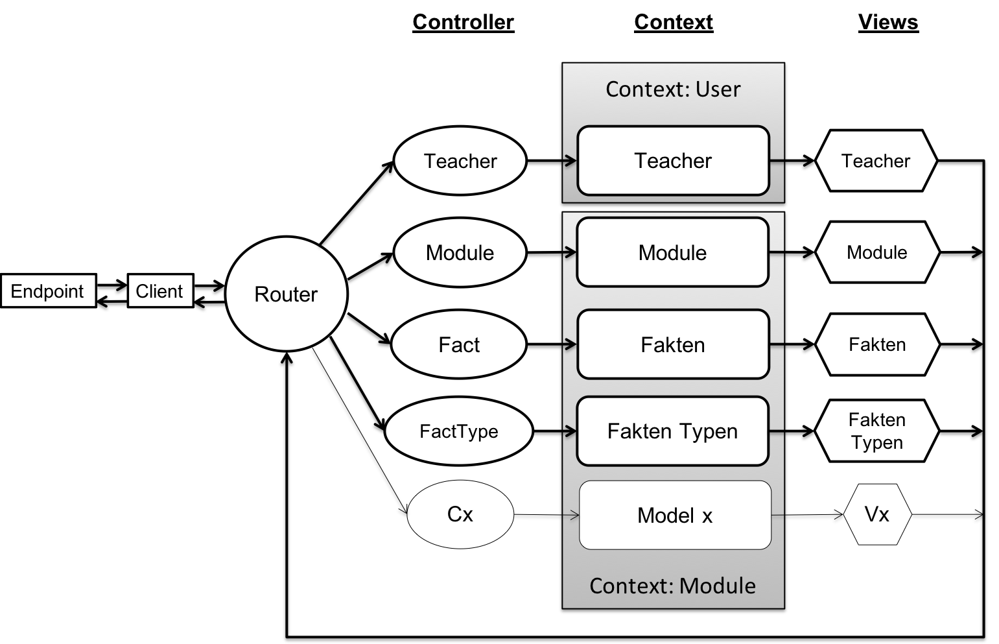

= Termdirectory
Niklas Liechti
:toc:
:toc-title: Inhaltsverzeichnis

== Systemanalyse

=== Projektidee

Das Ziel der Applikation ist es, das Backend für die Applikation Term Directory zu entwickeln. 
Um eine Challenge darzustellen, werde ich das Backend in Elixir zusammen mit dem Framework Phoenix umsetzen. 
Da Elixir eine für mich komplett neue Sprache ist und zudem noch komplett funktional, werde ich nur das Backend mit API entwickeln. 
Das Hauptziel hierbei ist es, mir die funktionale Denkweise anzueignen und zu vertiefen.

Um die Sprache richtig zu erlernen, lese ich das Buch "Learn Function Programming with Elixir. New Foundations for a New World"

=== Pflichtenheft

==== Muss Kriterien
* Es müssen Lehrer erstellt werden können
* Es müssen Module erstellt werden können
* Es müssen Fakten erstellt werden können
* Es müssen Fakt Typen erstellt werden können
* Für das Modul gibt es einen zuständigen Lehrer
* Für das Modul gibt es mehrere Lehrer, die an dem Modul arbeiten
* Das Modul kann mehrere Fakten haben
* Ein Fakt hat einen Fakt Typ

Diese Daten müssen persistiert werden. Das Ganze passiert über das Web in Form einer REST Api. Über diese API müssen dann die Daten auch wieder korrekt 
abgefragt werden können.

==== Nice to have

* Das Projekt kann per Docker deployed werden

==== Funktionstest

Alle muss Kriterien sind erfüllt. Es können alle Operationen die im Bereich <<API>> definiert sind durchgeführt werden und die Daten werden korrekt verarbeitet und gespeichert.
Auch die Nice to have Punkte konnten umgesetzt werden. Die app kann komplett autonom per Docker installierte werden.

Den einzige Schönheitsfehler, den ich nicht beheben konnte ist eine schöne fehlermeldung beim Löschen von referenzierten Einträgen. Momentan wird ein http/500 zurückgegeben,
der für den User der API keinen Rückschluss auf das wirkliche Problem erlaubt. Es passieren aber keine unerwarteten Aktionen auf den Daten

== Zeitplanung
Mein Hauptziel bei dieser Arbeit war es in funktionale Programmierung einzusteigen. Daher habe ich mich recht lange mit dem Buch: 
"Learn Functional Programming with Elixir" beschäftigt, in dem ich es gelesen habe und die Übungen darin gemacht habe. 
Danach wollte ich mit der Aufgabe meine Elixir Kenntnisse durch die Anwendung vertiefen, was nicht ganz geklappt hat, da ich die meiste Zeit 
mit der Datenbankanbindung, also Ecto verloren habe.
Daher wurde die Woche vor der Abgabe doch noch stressiger als gedacht und ich musste den Umfang leicht einschränken, indem ich nur Module, Lehrer und Fakten 
implementiert habe.
In dem Programm selbst stecken ca. 6 volle Arbeitstage.

== Entwicklung

=== OS
Ich habe das Ganze auf MacOS entwickelt. Elixir und das darunterliegende Erlang gibt es aber für alle erdenklichen Betriebssysteme

=== IDE
Als IDE habe ich IntelliJ von Jetbrains genutzt, da ich diese auch für alle andere Entwicklung im Geschäft oder privat benutze.

=== Datenbank
Die postgres DB kann entweder direk installiert werden, oder per Docker oder Docker-compose hochgefahren werden. In meinem fall habe ich einfach
``docker-compose up -d postgres`` im Ordner deployment gemacht. Dadurch wird einfach nur der Service postgres, also nur die DB hochgefahren.

=== Dokumentation
Zur Dokumentation des Ganze habe ich das asciidoc Format verwenden, da es etwas flexibler als Markdown ist. Um die Datei documentation.adoc in ein PDF umzuwandeln,
wird ein externes Program benötigt. Ich habe dazu https://asciidoctor.org/[Asciidoctor] verwendet.

<<<
== Dokumentation

=== Programmstruktur

Das Program ist folgendermassen aufgebaut. Alle Interaktionen gehen von einem Client aus, in unserem Fall einfach ein REST Client.
Grundsätzlich wird dann alles durch den Router an die Controller weitergeleitet, die dann entscheiden, was genau bei einer Aktion passieren soll. 
Im Context passiert dann die eigentliche Business Logik, sprich Datentransformation, DB abfragen und so weiter. Diese geben dann die aufbereiteten Daten
an eine View weiter, die entscheidet, wie etwas gerendert wird. In unserem Fall rendern die Views nur json files für die API.

Die Struktur der Applikation ist von Phoenix her vorgegeben. Alles was irgendwie, etwas mit dem Web oder einer Schnittstelle zu tun hat, 
muss im Ordner "lib/termDirectory_web" liegen. Darunter existieren dann die für uns wichtigen Ordner controllers und views.
Im Ordner "lib/termDirectory" ligen die Contexte, die wie oben erwähnt die Businesslogik beinhalten.

Des Weitern bietet Ecto die Möglichkeit migrationsscripts zu erstellen, um Schemaänderungen zu managen.
Dies funktioniert sehr ähnlich wie andere Migrationsprogramme z.B. Flyway. Es werden Dateien angelegt, die 
Instruktionen für die Datenbank enthalten. Die Dateien enthalten im Namen einen Timestamp und werden nach diesem
nacheinander ausgeführt. Dies ermöglicht eine kontrollierte Migration auf Test und Livesystemen. 
Sobald das erste Produktive System deployed ist, dürfen alte Dateien auf keinen Fall mehr angepasst werden, 
da es sonst zu inkonsistenten Daten kommen kann. Es muss dann immer ein neues File angelegt werden, welches die Änderungen enthält.

<<<
=== Database
Die Datenbank ist eine Postgres DB, die folgende Tabellen enthält: teachers, modules, module_workers, facts, fact_types. 
Die Beziehungen sind im unten stehenden ERD abgebildet

<<<
=== API

Die gesammte API ist unter /api/v1 erreichbar.

[cols="1,5a"]
|===
|Pfad |Aktion

|/teachers
| Folgende Aktionen sind erlaubt +

* Get: Liefert alle Lehrer
* Post: Erstellt einen neuen Lehrer
....
{
  "firstName": "Niklas",
  "lastName": "Liechti"
}
....
* ?search=searchtString: Sucht in den Feldern firstName und lastName

|/teachers/:id
| Folgende Aktionen sind erlaubt +
  
  * Get: Gibt den angefragten Lehrer zurück
  * Put: Updated einen bestehenden Lehrer. Argumente analog POST
  * Delete: Löscht den Lehrer mit der ID

|/factTypes
| Folgende Aktionen sind erlaubt +

* Get: Liefert alle Fakt Typen +
* Post: Erstellt einen neuen Fakt Typen
....
{
  "short_name": "example"
}
....
* ?search=searchtString: Sucht im Feld shor_name

|/factTypes/:id
| Folgende Aktionen sind erlaubt +
  
  * Get: Gibt den angefragten Fakt Typ zurück
  * Put: Updated einen bestehenden Fakt Typ. Argumente analog POST
  * Delete: Löscht den Fakt Typ mit der ID

|/facts
| Folgende Aktionen sind erlaubt +

* Get: Liefert alle Facts +
* Post: Erstellt einen neuen Fact, die beiden ID's müssen bereits existieren
....
{
  "value": "33",
  "remark": "Test Remark",
  "fact_type_id": 2,
  "module_id": 1
}
....
* ?search=searchtString: Sucht in den Feldern value und remark

|/facts/:id
| Folgende Aktionen sind erlaubt +
  
  * Get: Gibt den angefragten Fakt zurück
  * Put: Updated einen bestehenden Fakt. Argumente analog POST
  * Delete: Löscht den Fakt mit der ID

|/modules
| Folgende Aktionen sind erlaubt +

* Get: Liefert alle Module +
* Post: Erstellt einen neues Modul, responsible_teacher muss existieren und ist required. Module_workers müssen auch existieren
müssen aber nicht zwingend gesetzt werden
....
{
  "responsible_teacher_id": 1,
  "shortName": "Short module",
  "subject": "test subject",
  "module_workers": [
    1,
	2,
	...
  ]
}
....
* ?search=searchtString: Sucht in den Feldern shortName und subject

|/modules/:id
| Folgende Aktionen sind erlaubt +
  
  * Get: Gibt das angefragte Modul zurück
  * Put: Updated einen bestehendes Modul. Argumente analog POST
  * Delete: Löscht das Modul mit der ID
|===

=== Deployment

Das Deployment der Applikation geschieht mit Docker und Docker-Compose.
Um das Program starten zu können, muss sowohl https://docs.docker.com/install/[Docker] als auch https://docs.docker.com/compose/install/[Docker-Compose] installiert werden.
Um das Program und die Datenbank zu starten, kann einfach ``docker-compose up -d`` im Ordner deployments ausgeführt werden.

Um eine neu Version zu veröffentlichen kann einfach ``docker build -t nliechti/termdirectory . ; docker push nliechti/termdirectory`` im root Dir des Projektes ausgeführt werden. Beim nächsten compose up sollte dann die neue Version geladen werden.

== Reflexion

=== Elixir / Erlang

Das Ziel dieser Aufgabe war es für mich, das funktionale Programmieren anzuschauen und kennen zu lernen.
Die funktionale Entwicklung in Elixir unterscheidet sich hauptsächlich vom objektorientierten, indem es keine Objekte mit State zulässt.
Dies bedeutet, alles was man als Programmierer an Daten in der Hand hat, sind Immutable. Daher entstehen keinerlei Nebeneffekte
und das Programm kann im Normalfall sehr einfach parallelisiert werden und ist daher sehr performant auf multicore Maschinen.

Die grösste Challenge bei diesem Projekt war das komplette Umdenken von objektorientiert auf funktional. Ich habe eigentlich meine gesamte bisherige Laufbahn als Entwickler nur
objektorientiert gearbeitet. Daher fiel mir der umstieg und vor allem das Umdenken recht schwer. Der Tatsache und der Grund, warum alles Immutable ist, hat sich mir recht schnell erschlossen.
Ich bin aber trotzdem immer wieder, vor allem bei den kleinen Übungen im Buch in die falsche Richtung gelaufen und musste mir immer wieder überlegen, wie ich das jetzt funktional lösen könnte.

=== Ecto

Ecto ist der DB Abstraktionslayer, aber wie sie selbst auch sagen kein ORM (Object Relation Mapper), da dies in einer rein funktionalen Sprache gar nicht möglich ist.
Auch ist Ecto so leicht wie möglich gehalten, bedeutet also, es müssen viele Schritte selbst gemacht werden.
Dies bedeutet initial grösseren Aufwand, hilft aber über längere Zeit bei der Entwicklung, da kein oder nur sehr wenig Woodoo hinter den Kulissen passiert.

Weil ich bisher eigentlich nur mit ORM gearbeitet habe, die einem möglichst viel Arbeit abnehmen, hat mich das sehr viel Zeit gekostet, da ich bisher 
diese Aufgaben meist nicht selbst erledigen musste.

=== API Design

Während der Arbeit an der API, habe ich sehr viel über das designen von REST Api's gelernt. Das Wichtigste, dass ich gelernt habe, ist wohl, dass es keine genaue Spezifikation für eine REST Api gibt.
Das Meiste ist Interpratationssache und die Meinungen von Entwicklern gehen weit auseinander wie eine Api designt sein sollte.
Ich habe mich dafür entschieden nicht Objekte mitsamt allen Referenzen entgegen zu nehmen, sondern nur die Referenz ID auf das Objekt.

=== Phoenix

Phoenix ist ein Framework, dass in Elixir geschrieben ist. Es ist eigentlich ein Full Stack Framework, dass auf Funktionen vieler Komponenten aufbaut.
Den Frontend Teil des Frameworkes namens Plug, habe bis auf den Router nicht wirklich verwendet. Für die Datenbank Anbindung wird standartmässig Ecto verwendet.
Ecto ist ein unabhängiger DB Abstraktionslayer, der mir am meisten Mühe bereitete.
Für die Buisinesslogik wird einfach Elixir in einer bestimmt vorgegebenen Struktur verwendet.

Phoenix hilft einem mit Generatoren und vorgegebener Projektstruktur dabei, die Applikation recht schön zu strukturieren und die verschiedenen Schichten zu trennen.
Ob die vorgegebene Struktur richtig ist, lässt sich auch hier nicht abschliessend sagen. Ich finde die Trennung in Contexte recht gut, aber nicht immer ganz einfach.

==== Version 1.3

Im Juli 2017 erschien die Version 1.3 des Frameworkes, das viele grundlegende Mechaniken veränderte. Dieser Umstand bereitete mir viele Schwierigkeiten,
da viel Dokumentation von Dritten und Beispiele im Internet immer noch auf den alten Strukturen beruhen.

=== Probleme
Ich denke aber, obwohl die Aufgabenstellung einfach klang, war es doch ein bisschen zu viel auf einmal. Ich denke eine komplett neue Sprache und 2 sehr umfangreiche Frameworks auf einmal zu lernen, ist zu viel.
Um Elixir richtig zu lernen und in diesem Umfang richtig einzusetzten, braucht es meiner Meinung nach ca. 2 Monate Vollzeit Einarbeitung.

Die grössten Probleme hat mir aber Ecto bereitet, da es eine sehr eigene Art hat mit Daten umzugehen, was wiederum am rein funktionalen Elixir liegt. Die Dokumentation ist eigentlich super, wenn man das ganze Konzept dahinter voll durchlickt hat,
was ich in dieser Arbeit nicht ganz geschafft habe.

<<<
== Schlusswort
Im Grossen und Ganzen hat das Projekt wegen Ecto und der DB Anbindung zwar massiv mehr Zeit in Anspruch genommen als gedacht, aber die Arbeit mit Elixir
hat mir grundsätzlich Spass gemacht. Viele Features der Sprache und von Phoenix konnte ich leider gar nicht verwenden, da der Scope dadurch noch viel grösser geworden wäre.
Grundsätzlich bin ich aber immer noch ein Fan von stark typisierten Sprachen, da es einfach Vieles einfacher zu benutzen macht, weil schon beim schreiben 
des Codes klar ist was erlaubt ist und was nicht. Elixir hat auch eine Art Typisierung, diese griff in meinem Fall aber immer erst beim Compilen, was daran liegt,
dass das Tooling noch lange nicht so gut ist wie z.B. bei Java.

